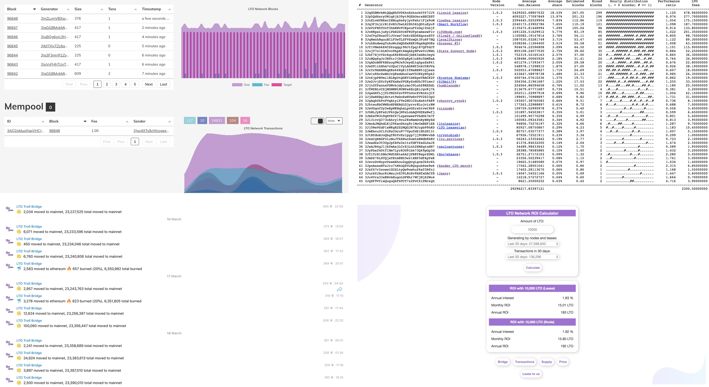

# Tech Tools


Our community is super talented and has built various cool tools to track network statistics: wallet movements, transactions generators, and so on. **You can build your own tool!**


Official tools developed by LTO network team are only [blockchain explorer](http://explorer.lto.network) and [web wallet](https://wallet.lto.network/start).

What's more important is that our talented community members built their own tools! This helps create a decentralized network, where every leasing node has their own community, as well as minimize security risks of trusting the core team to show the correct stats.

_The tools are built and maintained by the community. For the absolute transparency, you can cross-verify the data. If you see something is broken, not working correctly or you want to suggest an improvement - shoot a message in the_ [_Telegram chat_](https://t.me/joinchat/BrVdbEUBdYOXu4N8mY9wEQ)_._

* [Telegram Bot](https://t.me/LTO_FAQ_BOT): gives stats on cmc and FAQ 
* [Network overview v1.0](http://dev.pywaves.org/LTO/generators/): text format
* [Network overview v1.1](https://lto.services/network): visuals and charts
* [Bridge Troll](https://t.me/troll_bridge): telegram bot showing when a bridge transfer is being made
* [Staking ROI calculator](https://lto-lease.com/tools/roi): calculating staking and leasing ROI
* [Staking statistics](https://lto.banteg.xyz): fee distribution stats among nodes by blocks and their type
* [Node operators stats](https://t.me/LtoNodeUtilsBot): telegram utility bot for LTO node operators
* [Wallet Tracker](https://t.me/LTO_Wallet_Bot): telegram bot updating you on incoming and outcoming transactions
* [Community Explorer](https://lto.services/explorer): more in-depth explorer stats 
* [Distribution tool](https://github.com/jayjaynl/LTO_LPoSDistributor): re-distribution of leases

You can **build your own tool,** join the tech community:



