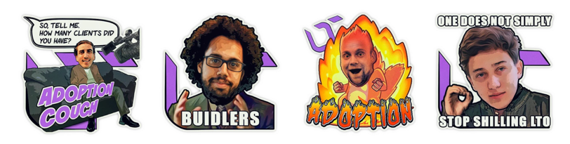

# Marketing Crew


Join the [**Marketing Chat**](https://t.me/joinchat/FmJTyxctTSOXRQKNechIKQ), send suggestions, get feedback, and fire it off! 


We write articles on tech, adoption, community management, and so on. You can see the log of the most interesting pieces in [this section](../real-time-progress/reviews-and-reports.md). If you need some inspiration, here are some ideas:

* Write educational content and spread it around on social media
* Help us get published in bigger traditional media sources 
* Connect the team to communities which we can do AMA and interviews with
* Make cool GIFs, stickers, memes - be creative

The marketing chat is all about taking the initiative and help LTO community expand and find new community members. Send suggestions to the chat and let's brainstorm together!

