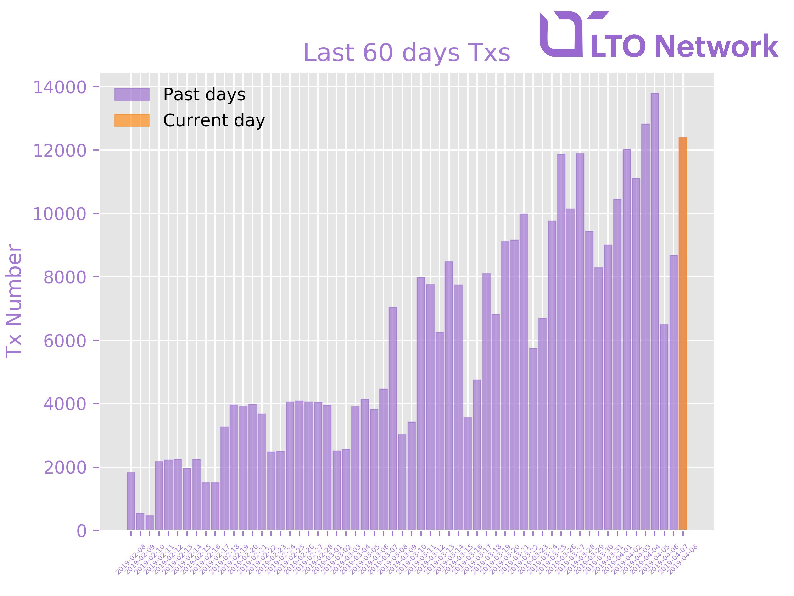
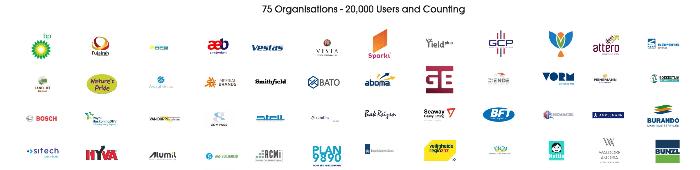

# Adoption: Partners & Clients

We don't need to make a product push by making clients change their current systems. It does not matter if a big client is directly using our new application or not. We work with integrators, re-sellers, software providers, etc. As long as their applications and products are integrated with the LTO Network back-end, adoption of the blockchain technology occurs instantly.


We do not need to reach every end client ourselves: by working with different integrators and software providers, we become the back-bone of all their applications. **Every new client or user of an integrator becomes a user of LTO Network.**

\*\*\*\*[**Help us get more integrators!**](../../community-area/social-mining/business-team.md)\*\*\*\*


**How to understand the significance and results of this?**

* Proof of engagement with clients \(pre-2019\) - &gt; [contracts](https://drive.google.com/open?id=1Gn0iJvQHurCTgBuZfk1ypK3nIJKsWxMn)
* Transposed into network activity -&gt; [explorer](http://dev.pywaves.org/LTO/generators/)


[**You can help us get more integrators and be rewarded**](../../community-area/social-mining/business-team.md)



[Check Telegram Bot for live stats &gt;&gt;](https://t.me/LTO_FAQ_BOT)


## **SignRequest**

#### **Adding proof to digital signatures**

SignRequest, one of Europe’s leading digital signing providers, added a new blockchain solution to its digital signature application. By integrating the Dutch-based blockchain platform LTO Network, they enable blockchain technology for more than 1 million users worldwide.



> Using the blockchain for Proof-of-Existence for digital signatures just makes sense and is already happening. When we researched blockchain platforms, LTO Network stood out in terms of speed, set-up and capabilities. We are able to include the blockchain transaction identifier directly into our signing logs which are circulated upon signing without the need to wait minutes for confirmations. Next to that, the potential of creating decentralized workflows did the trick to add the LTO Network solution. - Michaël Krens, CTO of SignRequest


The integration is live! Sign Request have their own node and are using anchoring on LTO public blockchain. You can find more info on SignRequest [product page](https://signrequest.com/en/electronic-signature-blockchain/).


## **Belgium, the Netherlands, Germany and other public agents**

**Supply Chain. Waste Transportation for ILT**

Dutch and Belgian governments, together with other public agents, AVR and Indaver, cooperate on the waste transportation solution as part of the EU tender LTO Network [won in 2018](https://sociable.co/technology/blockchain-waste-transportation/). Our partner Capptions is developing the UI, which is then integrated with LTO Network backend solution.

EU governments supervise the removal and transportation of waste to and from other EU countries, connecting multiple agencies to manage the operation. It formerly relied on manual, paper heavy processes, but by using LTO Network blockchain, the authority aims to free up human resources for other tasks. The LTO blockchain infrastructure provides an immutable way of verifying data about the weight of the shipment and the quota, making interactions among the parties trustless and secure. Data is being shared only across the stakeholders — since it has to be done in a GDPR compliant way.




The pilot has been in testing since July 2018, and has entered into the second stage in March 2019. It is not yet live on mainnet, but is planned to be integrated after the tests are finished. However, the Workflow Engine is already in use.


## **Capptions**

#### Giving blockchain a mobile face

Capptions is now integrating blockchain anchoring for their workflow applications. Every step in the workflow application is hashed and anchored on the LTO Network public blockchain utilizing **Proof Engine** \(an immutable digital notary\). This provides timestamping and ensures the integrity of digital data. An **immutable audit trail** can be shared with regulators, clients or value-chain partners in a secure way.

Capptions are dealing with environmental inspections carried out by the Dutch government, Oil terminal inspections for parties like Fujairah Oil and safeguarding re-fueling of thousands of aircrafts at Schiphol airport. The inspection app handles sensitive and vital data so immutability is critical. By implementing blockchain they’re able to let eco-systems of stakeholders monitor and secure a decentralized audit-trail in real-time at every stage.




The application is live, you can download Capptions app and try it out even in the demo version. Capptions have their own node and are using anchoring on LTO public blockchain. See the [product page](https://capptions.com/partner/ltonetwork#) for more info and links.


## **IBM Watson & Dutch Ministry of Justice**

#### **S**peeding up small criminal cases by 400%

Together with IBM Watson, LTO Network is developing a framework for the Dutch District Attorney’s office to optimize the so-called _ZSM-processes_ on the blockchain, while maintaining GDPR compliance and data privacy compliance. ZSM stands for _zo snel mogelijk_, Dutch for ‘as soon as possible’. These ZSM-processes are entirely administrative processes, where the accused simply has to pay a fine or perform a simple action, without extra steps like a court hearing.

Using LTO Network’s technology, the ZSM-processes are run on the blockchain, based on the predefined logic at the core of each process. All parties involved can participate in the process using their own systems, as process data is automatically exchanged between these systems. This prevents status bubbles, errors, deadlines and high lead times on files.


This is a pilot we are starting to work on in 2019. It will be utilizing both the public blockchain anchoring, Proof Engine, and Live Contracts, Workflow Engine.


## **CMS & MSeven**

**Automation of rental agreement lifecycles as Live Contracts**

M7 ****are working with LTO network on creating an automated document management tool on blockchain. FSM workflows can define commercial lease contract lifecycles as Live Contracts, which are paperless, remove multiple operational frictions among the parties, and have a lot of cost-cutting advantages over existing solutions.

> LTO Network aims to redefine the classic contract as we all know it today, through adding automatization and collaboration to it. The result: A dynamic contract process that allows for interaction on the property lease process involving multiple stakeholders. —  Niels Bruijninckx, Senior Manager, MSEVEN Real Estate

This is done together with CMS Law as a legal and business partner in verifying and promoting the solution. As the goal for 2019–2020, we are also working together with CMS Law on tokenizing real estate and shares, but we will get back to this later on.


This is a pilot we have started working on in 2019. It will be utilizing both the public blockchain anchoring, Proof Engine, and Live Contracts, Workflow Engine.


## **OSRE, Merin, Stena**

**Real Estate white-labelled portal**




The application is live. LegalThings have their own node and are using anchoring on LTO public blockchain. Live Contracts \(Workflow Engine\) is planned in the future.


## **Damste Notary, Hekkelman Notary, Lint Notary, etc.**

#### **Notary services with Firm24 as the integrator**

[FIRM24.com](https://www.firm24.com/) is one of the largest providers of the legal incorporation market in the Netherlands. On the platform that FIRM24 is using, the incorporation workflows include shareholders, notaries, bookkeepers, banks, etc are connected in the incorporation life cycle.


The application is live. Firm24 have their own node and are using anchoring on LTO public blockchain. Live Contracts \(Workflow Engine\) is planned in the future.


## **Heineken, Albert Heijn, Euronext, Velcro**

#### **DTM: Transfer Pricing Automation**

LTO software is used for automating the profit allocation workflows in each jurisdiction multinationals operate, and file the outcomes to the local tax authorities. It was built for and together with Taxtimbre, who act as a re-seller for these transfer pricing solutions.


The software of LegalThings is successfully integrated by TPThings. The software is using anchoring on LTO public blockchain, the node is hosted by software provider.


