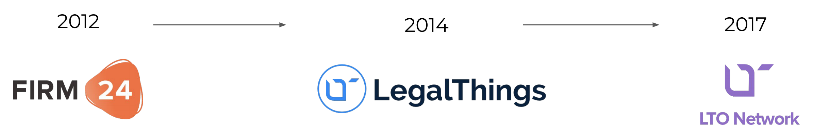

# Company: Team & Advisors


We have been growing since 2014. **LTO Network is not just a promise in a whitepaper - it is a reputable company with dozens of clients already using its solutions.**


We started in 2012 as the online notary service [FIRM24.com](https://www.firm24.com/en/home/). With time, we obtained approximately 10% of the Dutch incorporation market. The company still exists and is expanding. 

Then, in 2015, we saw a lot of potential in building software, and created [LegalThings](https://legalthings.io/). We provided centralized solutions to Heineken, Euronext, Dutch Ministry for Infrastructure, Dekra, and others. Those were workflow systems for automation of internal processes and other white-labelled solutions in the Digital Transaction Management market \([DTM](https://aragonresearch.com/dtm/)\).

We leverage on the clientele and experience acquired from these companies. Besides, they are integrators of LTO Network anchoring services, and in the future will also utilize Live Contracts. 



### What led to the creation of LTO Network?


Multinationals and governments invest billions of dollars in automation solutions such as ERP, BPMN and CRM to run their day-to-day processes as efficient as possible. However, the moment companies need to collaborate with other organizations or even between departments, the efficiencies of automation are gone. 

This so-called [silo effect](../about-tech/data-silo-problem.md) is the top barrier for organizations to reach a next level of efficiency of their business processes. Then along came Decentralized Ledger Technology \(DLT\), which has the potential to solve this problem without compromising productivity and data security. 


We were experimenting with PoCs on Bitcoin and Ethereum back in 2014-2015. After winning the 2017 Blockathon, we gave a stronger push to LTO Network \(rebranded from LegalThings One in 2018\) and pivoted to blockchain. We tried to work on Bitcoin, Ethereum, and Waves, but eventually developed our own ecosystem. Check [Token Paper](../../official-sources.md#papers) for the design process.


Our mission is to provide technology which fights bureaucracy, fraud and nepotism. A problem that plagues so many organizations, industries and governments. We believe that privacy and transparency are not mutually exclusive and are willing to prove it!


We have achieved a lot of milestones since the beginning, check the pre-2019 timeline:



