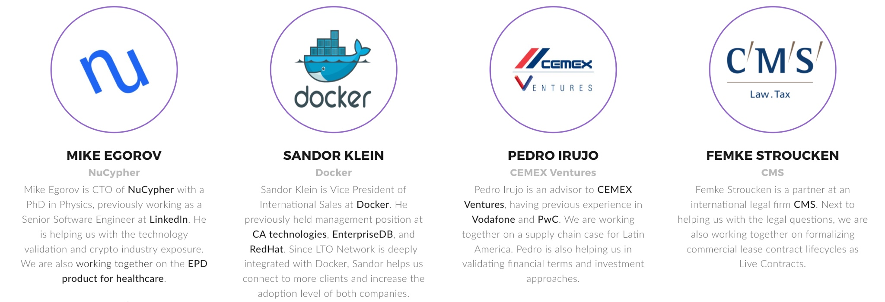

# Advisors

We value long-term relationships with our community, investors, partners, as well as advisors. Therefore, our public board is limited to only few highly qualified individuals in each area \(technology, sales, finance and legal\). Taking that into account, we also secured long-term relationships with our advisors and the companies they work in, making sure our partnerships will last for many months going forward. Here is the [announcement](https://medium.com/ltonetwork/advisory-board-of-lto-network-nucypher-docker-cemex-cms-law-6a37da6e4d97) from 2018.


For us, advisors are not just faces on the website. They have been helping us along the journey. **Alongside the public advisory board, we have dozens of very active and supportive community members who help us with adoption.** [You can become one](../../community-area/social-mining/marketing-team.md)! 


* Sales and Software Advisor: Sandor Klein

_Sandor has been working in enterprise software and IT world for many years, coming from CA Technologies where he worked as Global Account Director, then moving onto the 3-year position of Regional Manager in RedHat. Later on he joined EnterpriseDB as Vice President International Sales where he stayed for over 5 years_. S_ince 2015 Sandor has been Vice President of International Sales in Docker. At the beginning of 2019 he moved into his new venture, Sysdig._

* Technical Advisor: Michael Egorov

_Michael obtained a PhD degree in Physics and then worked on building a new Rb-K BEC machine at Monash University. After that he held the position of Senior Software Engineer at LinkedIn and then moved on to found NuCypher in 2015._

* Finance and Business Advisor: Pedro Irujo

_At the end of the ‘90s Pedro worked in PwC as Senior Consultant, moving onto a management position at Ernst&Young and later at Vodafone. After that he climbed to the top level of Neoris, a consulting company subsidiary of the CEMEX Group, and became a member and advisor of CEMEX Ventures._

* Legal and Business Advisor: Femke Stroucken

_Femke has been dedicated to Law her entire career. She has been working at CMS Law for 13 years. Femke is helping us with legal things \(pun intended\)regarding the implementation of blockchain, GDPR, and so on. Moreover, we are working on a joint project focusing on formalizing commercial lease contract lifecycles as Live Contracts._

