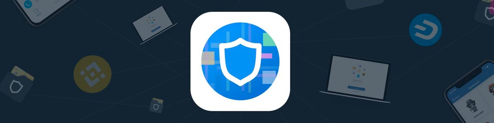

# FAQ

## Where can I store LTO, can I use Ledger?

If you bought tokens on an exchange, it means you are holding ERC-20 LTO. Those you can store in any wallet as long as the wallet allows for adding custom contracts. For example, you can use [**TrustWallet**](https://eps2.app.link/?&event=newToken&contract=0x3db6ba6ab6f95efed1a6e794cad492faaabf294d) ****or store them on Ledger via MEW access. 

* Contract address: [**0x3db6ba6ab6f95efed1a6e794cad492faaabf294d**](https://etherscan.io/token/0x3db6ba6ab6f95efed1a6e794cad492faaabf294d)\*\*\*\*
* Ticker: LTO
* Decimals: 8

If you have mainnet tokens, then you can store them in the [mainnet wallet](https://wallet.LTO.network/start). It's not an actual wallet, it just generates a key pair for you, you are responsible for you keys, we don't control your LTO. Thus, make sure to save your seed and private key, more about security notes [here]().

If you hold ERC-20 LTO, you cannot participate in staking and mining, that's only possible on mainnet. **If you hold mainnet LTO, you can** [**stake and mine**](../community-area/mining-staking.md)**, as well as combine it with** [**social mining**](../community-area/social-mining/) **- essentially getting more LTO rewards for being an active community member.** 

## Will there be a full token swap?

Mainnet is live, but the movement over the [Bridge](token/#mainnet-less-than-greater-than-erc-20-bridge) is seamless, so the difference with regard to which token you own becomes redundant after the bridge fee goes to almost 0%. We do not need to close the bridge. If we were to make the swap, it would most likely not even be in 2019. In that case, we would just keep the bridge open for one way, and give everyone plenty of time to swap.

## Are Smart Contracts similar to Live Contracts?

A Live Contract allows determining custom on-chain logic for every process \(ad-hoc private chains, horizontally scalable\). That logic is modeled as a Finite State Machine and is understandable for both computers and humans. Smart Contracts cannot be applied to what Live Contracts can be, and vice versa. It’s a different product. Check out an article explaining [LTO Network’s architecture](about-tech/) + [the differences between Live Contracts and Smart Contracts](https://medium.com/harvard-undergraduate-blockchain-group/lto-network-how-reducing-power-increases-utility-bca7ca60bae4). So they are both applicable in different use cases, and **in fact, you can even model a Live Contract in such a way to trigger a Smart Contract, so the applications of Live Contracts are very broad**.

## Which countries is LTO focusing on?

Europe and the US companies/software providers are our main market for the coming few months because we are known there and have connections. South America is another step. Asia is not per se our immediate market fit: both because of geographical distance and because of some features like GDPR compliance which is not really needed there, yet. It is something everyone will have to comply with no matter their location, but the urgency for such a solution is more seen in Europe and the US at this point. The hybrid solution is globally applicable, so we will be going into every house of the world essentially, but step by step.

## Exchanges. When new, sir?

At the moment [LTO](token/) \(only ERC-20\) is listed on [BitMax](https://bitmax.io/#/trade/btc/lto) and [IDEX](https://idex.market/eth/lto).

We are in touch with other exchanges, but we do not want to lie about these things, same way as we do not announce our "client leads". If something is production-ready, we announce it. Nothing like "oh we are in negotitations with xyz..." - this sounds misleading. So we are aware of the global token holder expansion and higher volume support - we want that too. But for now the best thing community members can do is to participate in the network: staking, leasing, helping with marketing and bizdev. Good product and good communities get through anything! 

So in short: yes we are in touch, we are actively working on it. But we only aim for the best ones, so it takes time. I just want to emphasize that the narrative of "big volume exchange fomo" of 2017 is pretty much dead, check the recent listings. **We should all work together on adoption, and anyone can get involved in that! Because what drives the value is not PnD, but usage.**

## Any plans for team and office expansion?

I think I can refer to the [Strategic Business Plan](adoption/strategic-business-plan.md) for one part of the question regarding “what and for who”. As for team expansion to other geographical areas, the US would be the first step for us. As the solution progresses, we will not contain ourselves within any boundaries to make the solution globally widespread! It's probably good to point out that we have experience with team scaling: it has to be gradual and at a good pace. Hiring dozens of people in a short period of time leads to a complete mess.

## I participated in seed on Waves. How do I swap?

_Don't pay attention to this if you were not in seed, it is not relevant for you._

We have migrated to our own mainnet with [our own token](token/), and have a number of[ large clients](adoption/)! The total supply was increased to make it easier to work with the numbers, instead of having too many decimals. Since the initial token price at [crowd sale](token/sale-stages.md) was decreased by 10 times \(0.3 -&gt; 0.03 USD\), your waves token supply is increased by 10 times during the swap as well. So essentially it ends up being 1:1. Read here about [**how to swap from waves**](https://telegra.ph/How-to-Token-swap-from-WAVES-to-LTO-Mainnet-01-26), and pay attention to the bridge troll when interacting with the [ERC-20](token/bridge-troll.md).

