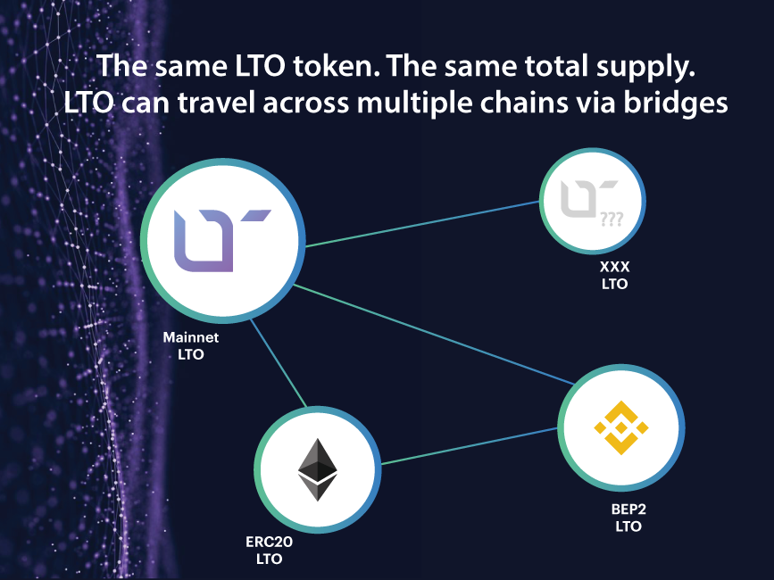

# Token: Utility & Bridge Troll

**LTO exists as Mainnet coin, ERC-20 token and BEP2 token.** The total supply is simply being split among different blockchains, where the bridges make the flows possible. 


It’s the same LTO token, it just exists on different blockchains. [**Swap in-wallet, it's super easy**](https://wallet.lto.network/start).


* **Mainnet LTO tokens – for utility**. This is where the magic happens. LTO mainnet has been live since January 2019 and is now ranked in the top-20 most used blockchains \(Source: [Blocktivity](https://blocktivity.info/)\), with over 20K daily transactions. Mainnet LTO, the actual utility token, serves two purposes:
  * **Transaction fees** when you interact with the LTO blockchain whether it’s a normal transfer, an anchoring transaction, or something else. 
  * **Staking**. By staking on a node, either by running it or leasing to it, you receive rewards for the blocks forged by that node proportionate to your stake. It’s a variation of Proof of Stake model.
* **ERC20 tokens – for liquidity.**  They are present on Ethereum and are intended for liquidity. Only the ERC20 tokens are directly tradeable. To trade mainnet LTO, one needs to make a bridge swap.
* **BEP2 tokens – for liquidity.** They are present on Binance Chain and are also intended for the purposes of liquidity and act the same as ERC20 tokens.

**There is no network inflation, mining rewards are the transactions fees paid by network users**. They can be coming from normal transfers, but around 99% of them are anchoring transactions resulting from clients and integrators using LTO Network engines.


**Extensive** [**token paper**](../../official-sources.md) mapping out the network incentives and token design process.


> Companies that are not 100% familiar with blockchain or token markets do not need to concern themselves with acquiring tokens. Those with LTO tokens can lease out their tokens to XYZ for example , or XYZ can have tokens staked by their integrator. Of course, if clients want to buy tokens, they are free to do so. **In any case, LTO tokens are used at all times — whether companies purchase or lease them.** - [Altcoin Magazine](https://medium.com/altcoin-magazine/is-there-a-disconnect-between-token-value-and-product-usage-bb4f8da65ec4)

**More information on staking, mining, and network fees:**



